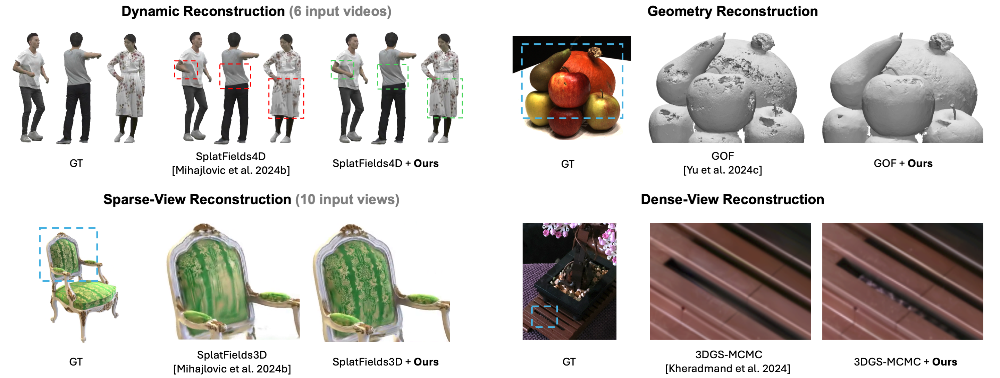

# Neural Texture Splatting: Expressive 3D Gaussian Splatting for View Synthesis, Geometry, and Dynamic Reconstruction

<div align="center">


**SIGGRAPH Asia 2025 (Conference Track)**

[Yiming Wang](https://19reborn.github.io/), [Shaofei Wang](https://taconite.github.io/), [Marko Mihajlovic](https://markomih.github.io/), [Siyu Tang](https://vlg.inf.ethz.ch/team/Prof-Dr-Siyu-Tang.html)

ETH Zürich


[](https://19reborn.github.io/nts/)
[](https://arxiv.org/abs/2511.18873)
</div>
<br>

<br>

**Neural Texture Splatting (NTS)** extends 3D Gaussian Splatting by introducing a local neural RGBA field per primitive. This codebase is built on [Gaussian Opacity Fields](https://github.com/autonomousvision/gaussian-opacity-fields), showcasing NTS’s ability to improve novel-view synthesis and surface reconstruction.


## Setup


### 1. Environment

```bash
conda create -y -n nts python=3.8
conda activate nts

# Install PyTorch (Adjust for your CUDA version if necessary)
pip install torch==2.0.1 torchvision==0.15.2 --index-url [https://download.pytorch.org/whl/cu118](https://download.pytorch.org/whl/cu118)
conda install -y -c "nvidia/label/cuda-11.8.0" cuda-toolkit

# Install dependencies
pip install -r requirements.txt
pip install submodules/diff-gaussian-rasterization_3dtex
pip install submodules/simple-knn/
```

*Optional*: Build tetra-triangulation (required for GOF-style mesh extraction). If you encounter issues, please check the original GOF repository.
```
cd submodules/tetra-triangulation
conda install cmake
conda install conda-forge::gmp
conda install conda-forge::cgal

cmake .
# (Optional) Specify your CUDA path:
# export CPATH=/usr/local/cuda-11.3/targets/x86_64-linux/include:$CPATH

make
pip install -e .
```


### 2. Data Preparation

* **NeRF-Synthetic:** Download from the [NeRF Google Drive](https://drive.google.com/drive/folders/128yBriW1IG_3NJ5Rp7APSTZsJqdJdfc1).
* **DTU:**
    * **Images:** Download the preprocessed data from the [2DGS website](https://surfsplatting.github.io/).
    * **GT Point Clouds:** Download from the [official DTU website](https://roboimagedata.compute.dtu.dk/?page_id=36) (required for geometry evaluation).


## Training and Evaluation

Use these scripts to reproduce the experiments reported in the paper.

```bash
# NeRF
python scripts/run_nerf_synthetic.py
python scripts/show_nerf_synthetic.py

# DTU
python scripts/run_dtu.py
python scfipts/show_dtu.py
```

# TODO
- [ ] **3DGS-MCMC + NTS** for improved unbounded scene performance.
- [ ] **SplatFields + NTS** for sparse-view and dynamic reconstruction.


## Citation
```
@misc{wang2025neuraltexturesplattingexpressive,
      title={Neural Texture Splatting: Expressive 3D Gaussian Splatting for View Synthesis, Geometry, and Dynamic Reconstruction}, 
      author={Yiming Wang and Shaofei Wang and Marko Mihajlovic and Siyu Tang},
      year={2025},
      eprint={2511.18873},
      archivePrefix={arXiv},
      primaryClass={cs.CV},
      url={https://arxiv.org/abs/2511.18873}, 
}
```